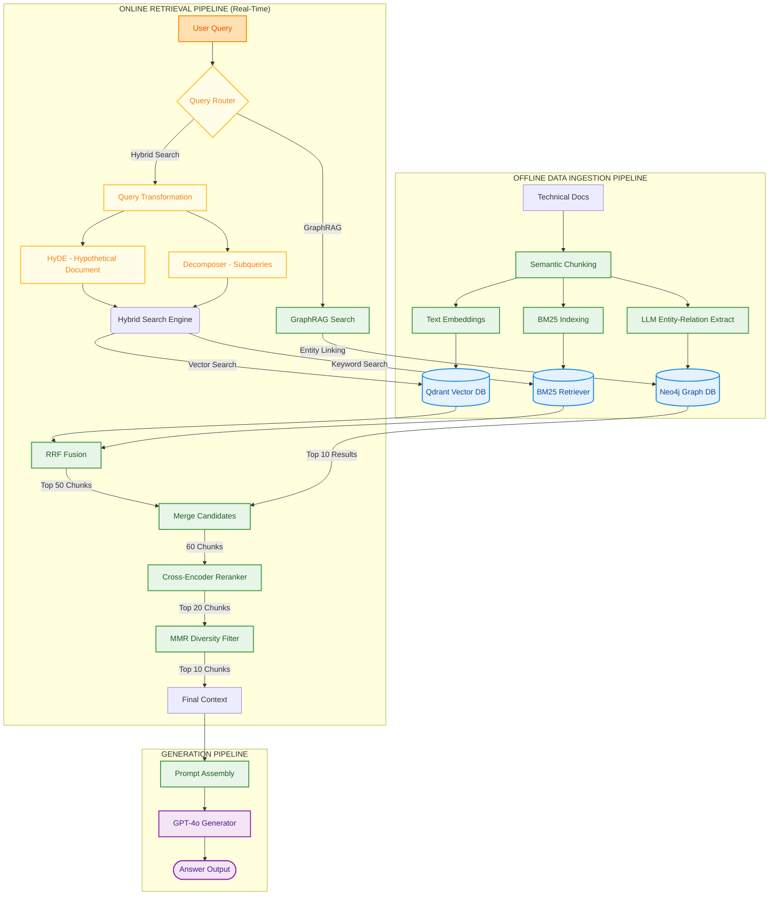

# Enterprise RAG System for TechDocs Inc.

<p align="left">
  <a href="#-evaluation-metrics--performance">
    
  </a>
  <a href="#-evaluation-metrics--performance">
    
  </a>
  <a href="#-evaluation-metrics--performance">
    
  </a>
</p>

<p align="left">
  <a href="#-technology-stack">
    
  </a>
  <a href="#-technology-stack">
    
  </a>
  <a href="#-technology-stack">
    
  </a>
  <a href="#-technology-stack">
    
  </a>
  <a href="#-technology-stack">
    
  </a>
  <a href="#-getting-started">
    
  </a>
</p>

An advanced, production-grade Retrieval-Augmented Generation (RAG) system designed to solve search challenges in large technical repositories. The system features semantic chunking, hybrid search (Vector + BM25 with RRF), query transformation (HyDE & Decomposition), post-retrieval processing (Cross-Encoder Reranker & MMR), and GraphRAG (Neo4j).


---

## 🏗️ Architecture Overview

The system operates on an End-to-End pipeline combining Vector Search, Keyword Search, and Graph Databases:



---

## 🛠️ Technology Stack

| Layer | Technologies / Frameworks | Purpose |
|---|---|---|
| **Programming Language** | Python 3.10+, JavaScript (Vanilla) | Backend logic, pipeline, and interactive web frontend. |
| **Package Manager** | `uv` (by Astral) | Fast dependency management and virtual environments. |
| **Vector Database** | Qdrant | Dense vector retrieval using HNSW indexing. |
| **Graph Database** | Neo4j (GraphRAG) | Knowledge Graph representation of documents, entities, and relations. |
| **Keyword Search** | BM25 (Rank-BM25) | Classical lexical search for error codes, API URLs, and product catalogs. |
| **Embeddings & Reranking** | SentenceTransformers (`all-MiniLM-L6-v2`, `cross-encoder/ms-marco-MiniLM-L-6-v2`) | Local embedding generation and Cross-Encoder passage reranking. |
| **Orchestration / LLM** | OpenAI API (`gpt-4o-mini`), LangChain | Intent routing, query decomposition, HyDE, entity extraction, and final generation. |
| **Backend Framework** | FastAPI, Uvicorn | Production-ready asynchronous API server. |
| **Frontend UI** | HTML5, Vanilla CSS (Modern glassmorphic theme), JavaScript | Sleek web chat UI with real-time response streams and source citations. |

---

## 🌟 Key Features

*   **Semantic Chunking:** Cuts documents based on semantic similarity of contiguous sentences instead of static token length, preserving context boundaries.
*   **Hybrid Search & RRF:** Merges dense vector representations (Qdrant) and lexical keyword matching (BM25) using **Reciprocal Rank Fusion (RRF)** to retrieve both semantic meaning and technical terms (e.g., error codes, API methods).
*   **Query Transformation:** 
    *   **HyDE (Hypothetical Document Embeddings):** Generates hypothetical answers to enrich short user queries before searching.
    *   **Decomposition:** Breaks down complex, multi-part questions into simpler sub-queries.
*   **Post-Retrieval Processing:**
    *   **Cross-Encoder Reranker:** Scores the exact query-chunk pairs using a cross-attention transformer, correcting ordering flaws.
    *   **MMR (Maximal Marginal Relevance):** Filters out duplicate information and enforces context diversity.
*   **GraphRAG (Neo4j):** Extracts entities (Policies, Stakeholders, Products, etc.) and relations to answer global, macro-level questions that traditional vector databases struggle with.
*   **FastAPI & Modern Web UI:** Serves a production-ready HTTP API accompanied by a modern, responsive web chat client.

---

## 📁 Project Structure

```text
├── data/                       # Seeded documents (.md files)
├── sample_data/                # Raw sample documents
├── src/                        # Core codebase
│   ├── config.py               # Settings & configuration (Pydantic)
│   ├── indexing/               # loaders, semantic chunker, vector store
│   ├── retrieval/              # BM25, hybrid search
│   ├── query_transformation/   # Router, HyDE, Decomposer
│   ├── post_retrieval/         # Cross-Encoder reranker, MMR
│   ├── graph/                  # Neo4j Graph DB operations, entity extraction
│   └── orchestrator/           # End-to-end pipeline, evaluator
├── scripts/                    # Utilities for seeding, indexing & validation
├── frontend/                   # HTML/CSS/JS Chat Interface
├── app.py                      # FastAPI Backend API entrypoint
├── main.py                     # Interactive terminal CLI entrypoint
├── Dockerfile                  # Multi-stage slim Docker image configuration
├── docker-compose.yml          # Orchestrates backend, Qdrant, and Neo4j services
├── .dockerignore               # Excludes virtual environments and temporary caches from builds
└── pyproject.toml              # Project metadata & dependencies managed via uv
```

---

## 🛠️ Getting Started

### 1. Common Pre-requisite: Environment Setup

Before selecting a method below, clone the repository, copy `.env.example` to `.env` and fill in your OpenAI API Key:

```bash
# Clone the repository and navigate inside
git clone https://github.com/BaoNguyenz/Enterprise_RAG_system.git
cd "Enterprise RAG system"

# Copy environmental file
cp .env.example .env
```
Fill in the `OPENAI_API_KEY` in `.env`. Ensure other settings are left to defaults for standard setup.

---

### 🐳 Method 1: Docker Compose Deployment (Recommended)
This runs the entire stack inside lightweight Docker containers without needing Python or local packages.

#### 1. Start all containers (Databases + Web Application)
```bash
docker compose up -d
```
Docker will pull Qdrant, Neo4j, download dependencies using `uv` inside a multi-stage container, download NLTK data, and start the FastAPI server on port `8000`.

#### 2. Seed and Index documents
Since the databases are blank, you must run the indexing scripts. You can run them directly inside the running container:
```bash
# A. Seed documents
docker compose exec web python scripts/seed_data.py

# B. Build hybrid search index (BM25 + Qdrant vectors)
docker compose exec web python scripts/index_documents.py

# C. Build GraphRAG Knowledge Graph in Neo4j
docker compose exec web python scripts/build_graph.py
```

#### 3. Access Services
- **Web UI:** `http://localhost:8000` (Directly interactive web chat!)
- **FastAPI OpenAPI Docs:** `http://localhost:8000/docs`
- **Qdrant DB Console:** `http://localhost:6333/dashboard`
- **Neo4j DB Browser:** `http://localhost:7474` (Credentials: `neo4j` / `password123`)

To stop the services: `docker compose down`

---

### 💻 Method 2: Local Development (Best for Editing Code)
This method runs databases in Docker containers but executes Python scripts and the FastAPI web server directly on your host machine.

#### 1. Setup local environment using `uv`
Ensure you have [Python 3.10+](https://www.python.org/downloads/) and [uv](https://github.com/astral-sh/uv) installed.
```bash
# Create local virtual environment and install dependencies
uv venv
uv pip install -e ".[dev]"
```

#### 2. Spin up only the Databases
```bash
# Starts Qdrant and Neo4j containers
docker compose up -d qdrant neo4j
```

#### 3. Seed & Index documents locally
```bash
# Seed documents to directory
uv run python scripts/seed_data.py

# Load documents to Qdrant & build local BM25 index
uv run python scripts/index_documents.py

# Extract graph entities & push to Neo4j
uv run python scripts/build_graph.py
```

#### 4. Run Interactive Interfaces
- **Terminal CLI Chat:**
  ```bash
  uv run python main.py
  ```
  *(Type `/help` to see options, `/mode <mode>` to switch algorithms, `/eval` to benchmark, `/quit` to exit)*

- **Backend API Server (with auto-reload on changes):**
  ```bash
  uv run uvicorn app:app --reload
  ```
  Open `http://localhost:8000` to interact with the GUI, or visit `http://localhost:8000/docs` to test endpoints.

---

## 📊 Evaluation Metrics & Performance

The RAG pipeline is evaluated end-to-end using Ragas-like metrics (Context Relevance & Answer Faithfulness) evaluated via LLM-as-a-judge.

### Summary Metrics (Average across 6 benchmark queries)

| Metric | Score / Value | Description |
|---|---|---|
| **Context Relevance** | **0.4130** | Assesses how relevant the retrieved context chunks (after Post-Retrieval MMR and Reranking) are to the user query. |
| **Answer Faithfulness** | **0.8333** | Measures whether all claims in the generated response are strictly grounded in the retrieved context (no hallucinations). |
| **Average Latency** | **4.91s** | Total end-to-end round trip time. |

### Average Latency Breakdown per Stage
*   **Query Classification (Router):** `0.000s` (Deterministic/Fast prompt mapping)
*   **Vector/Keyword Retrieval:** `1.018s` (Qdrant & BM25)
*   **GraphRAG Search (Neo4j):** `1.509s` (Entity extraction & traversal)
*   **Post-Retrieval Processing:** `0.583s` (Cross-Encoder & MMR)
*   **LLM Generation:** `1.803s` (Response generation)

---

## 🧪 Testing & Verification

The project includes test scripts for verifying each task separately:

```bash
# Verify Task 2: Vector + BM25 Hybrid Search (no API key needed)
uv run python scripts/test_hybrid_search.py

# Verify Task 3: Query Routing, HyDE, and Decomposition
uv run python scripts/test_query_transformation.py

# Verify Task 4: Cross-Encoder Reranking and MMR (no API key needed)
uv run python scripts/test_post_retrieval.py

# Verify Task 5: Neo4j Graph Database extraction and GraphRAG queries
uv run python scripts/test_graph.py
```
