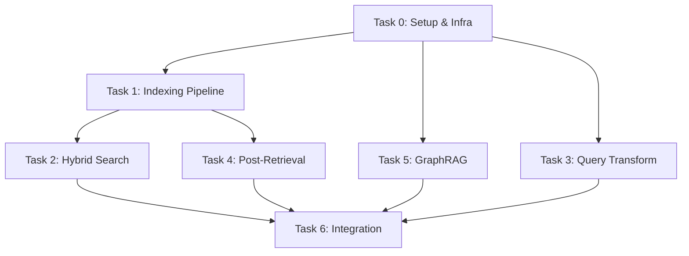

# Enterprise RAG System — Implementation Plan

## Tổng quan

Xây dựng hệ thống **Enterprise RAG** cho TechDocs Inc. xử lý 20 tài liệu (7 technical, 7 policy, 6 product) với 6 optimization techniques. Hệ thống được chia thành **6 task độc lập**, implement tuần tự, mỗi task là một milestone có thể test riêng.

---

## Stack Kỹ thuật đã chọn

| Component | Choice | Ghi chú |
|-----------|--------|---------|
| **Package Manager** | `uv` | Quản lý env + deps |
| **LLM** | OpenAI GPT-4o-mini (default) / GPT-4o | Qua `openai` SDK |
| **Embedding** | `all-MiniLM-L6-v2` | Local, free, 384-dim |
| **Vector DB** | Qdrant (Docker) | HNSW native, filtering mạnh |
| **Graph DB** | Neo4j (Docker) | `neo4j:5-community` |
| **Cross-Encoder** | `cross-encoder/ms-marco-MiniLM-L-6-v2` | CPU mode (auto-detect GPU) |
| **LangChain** | Minimal — chỉ ChatModel + Embeddings wrapper | Custom logic cho retrieval |
| **Backend** | FastAPI + Swagger UI | API endpoints |
| **Frontend** | HTML + CSS + JS (vanilla) | Giao diện đơn giản |
| **Python** | 3.10+ | |

---

## Cấu trúc Project

```
enterprise-rag-system/
├── pyproject.toml              # uv project config
├── .env                        # API keys (gitignored)
├── .env.example                # Template
├── .gitignore
├── README.md
├── docker-compose.yml          # Qdrant + Neo4j
│
├── data/                       # Sample documents (symlink/copy)
│   ├── technical_docs/
│   ├── policy_docs/
│   └── product_catalog/
│
├── src/
│   ├── __init__.py
│   ├── config.py               # Settings (Pydantic BaseSettings)
│   ├── models.py               # Shared data models (Document, Chunk, etc.)
│   │
│   ├── indexing/               # Task 1
│   │   ├── __init__.py
│   │   ├── document_loader.py
│   │   ├── semantic_chunker.py
│   │   └── vector_store.py
│   │
│   ├── retrieval/              # Task 2
│   │   ├── __init__.py
│   │   ├── bm25_retriever.py
│   │   ├── hybrid_search.py
│   │   └── query_router.py
│   │
│   ├── transformation/         # Task 3
│   │   ├── __init__.py
│   │   ├── hyde.py
│   │   ├── query_decomposition.py
│   │   └── transformation_router.py
│   │
│   ├── post_retrieval/         # Task 4
│   │   ├── __init__.py
│   │   ├── cross_encoder_reranker.py
│   │   ├── mmr.py
│   │   └── post_retrieval_pipeline.py
│   │
│   ├── graph/                  # Task 5
│   │   ├── __init__.py
│   │   ├── entity_models.py
│   │   ├── entity_extractor.py
│   │   ├── knowledge_graph.py
│   │   └── graph_retriever.py
│   │
│   └── orchestrator/           # Task 6
│       ├── __init__.py
│       ├── pipeline.py         # Unified RAG pipeline
│       └── evaluator.py        # Logging + metrics
│
├── app.py                      # FastAPI backend
├── main.py                     # CLI entry point
│
├── frontend/                   # HTML/CSS/JS UI
│   ├── index.html
│   ├── style.css
│   └── app.js
│
├── scripts/                    # Utility scripts
│   ├── index_documents.py      # Run indexing pipeline
│   ├── build_graph.py          # Populate Neo4j
│   └── seed_data.py            # Copy sample_data → data/
│
├── tests/                      # Unit tests per task
│   ├── test_chunker.py
│   ├── test_bm25.py
│   ├── test_hybrid.py
│   ├── test_hyde.py
│   ├── test_reranker.py
│   ├── test_graph.py
│   └── test_pipeline.py
│
├── submission_answers.md       # 3 câu hỏi lý thuyết
└── evaluation_report.md        # Kết quả đánh giá
```

---

## User Review Required

> [!IMPORTANT]
> **GPU cho Cross-Encoder**: Bạn nói có GPU NVIDIA nhưng chưa setup CUDA. Tôi sẽ cài `torch` bản CPU trước (đủ cho 50 candidates re-rank). Nếu muốn dùng GPU sau, chỉ cần `uv pip install torch --index-url https://download.pytorch.org/whl/cu121`.

> [!IMPORTANT]
> **Cấu trúc `sample_data` hiện tại** có nested 2 lớp: `sample_data/sample_data/...`. Tôi sẽ tạo script `seed_data.py` để copy/flatten vào `data/` cho gọn. OK không?

> [!WARNING]
> **OpenAI API Cost**: HyDE, Query Decomposition, Entity Extraction, NL-to-Cypher đều gọi OpenAI. Tôi sẽ dùng `gpt-4o-mini` mặc định (rẻ 15x so với gpt-4o) và implement **response caching** (cache file JSON) trong development. Bạn cần chuẩn bị API key trong `.env`.

> [!IMPORTANT]
> **Docker**: Cần Docker Desktop chạy sẵn cho cả Qdrant và Neo4j. Tôi sẽ tạo `docker-compose.yml` để `docker compose up -d` một lần. Bạn đã cài Docker Desktop chưa?

---

## Proposed Changes — Chi tiết từng Task

---

### Task 0: Project Setup & Infrastructure (Foundation)

> Phải hoàn thành trước khi bắt đầu bất kỳ task nào.

#### [NEW] `pyproject.toml`
- Khởi tạo project với `uv init`
- Define dependencies:
  ```toml
  [project]
  name = "enterprise-rag-system"
  version = "0.1.0"
  requires-python = ">=3.10"
  dependencies = [
      "openai>=1.0.0",
      "sentence-transformers>=2.2.0",
      "qdrant-client>=1.7.0",
      "rank-bm25>=0.2.2",
      "pydantic>=2.0.0",
      "pydantic-settings>=2.0.0",
      "neo4j>=5.0.0",
      "langchain>=0.1.0",
      "langchain-openai>=0.1.0",
      "langchain-neo4j>=0.1.0",
      "fastapi>=0.100.0",
      "uvicorn>=0.20.0",
      "python-dotenv>=1.0.0",
      "nltk>=3.8.0",
      "numpy>=1.24.0",
  ]
  ```

#### [NEW] `docker-compose.yml`
```yaml
services:
  qdrant:
    image: qdrant/qdrant:latest
    ports:
      - "6333:6333"    # HTTP API
      - "6334:6334"    # gRPC
    volumes:
      - qdrant_data:/qdrant/storage

  neo4j:
    image: neo4j:5-community
    ports:
      - "7474:7474"    # Browser UI
      - "7687:7687"    # Bolt
    environment:
      NEO4J_AUTH: neo4j/password123
    volumes:
      - neo4j_data:/data

volumes:
  qdrant_data:
  neo4j_data:
```

#### [NEW] `.env.example`
```env
OPENAI_API_KEY=sk-...
OPENAI_MODEL=gpt-4o-mini
QDRANT_HOST=localhost
QDRANT_PORT=6333
NEO4J_URI=bolt://localhost:7687
NEO4J_USER=neo4j
NEO4J_PASSWORD=password123
EMBEDDING_MODEL=all-MiniLM-L6-v2
CROSS_ENCODER_MODEL=cross-encoder/ms-marco-MiniLM-L-6-v2
```

#### [NEW] `src/config.py`
- `Settings` class kế thừa `pydantic_settings.BaseSettings`
- Load từ `.env`, type-safe, có default values cho tất cả config
- Các settings: LLM model, embedding model, vector DB connection, Neo4j connection, HNSW params, chunking params, search params

#### [NEW] `src/models.py`
- `Document`: page_content + metadata
- `Chunk`: content, chunk_id, doc_id, document_type, embedding (optional)
- `SearchResult`: chunk, score, source (bm25/vector/hybrid/graph)
- `QueryType` enum: SIMPLE, KEYWORD, SEMANTIC, COMPLEX
- `SearchStrategy` enum: BM25, VECTOR, HYBRID

#### [NEW] `scripts/seed_data.py`
- Copy `sample_data/sample_data/{technical_docs,policy_docs,product_catalog}/` → `data/`
- Flatten cấu trúc thư mục

**Verification**: `uv run python -c "from src.config import settings; print(settings)"` — in ra settings thành công.

---

### Task 1: Advanced Indexing Pipeline (20 points)

**Dependency**: Task 0  
**Mục tiêu**: Document → Semantic Chunks → Vector embeddings → Qdrant HNSW index

#### [NEW] `src/indexing/document_loader.py`
- `load_all_documents(data_dir: Path) -> list[Document]`: đọc tất cả `.md` files
- Tự detect `document_type` từ folder name (technical/policy/product)
- Tạo metadata: source path, filename, doc_id, document_type
- Đếm và log số documents loaded per type

#### [NEW] `src/indexing/semantic_chunker.py`
- **Class `SemanticChunker`**:
  - Khởi tạo với `SentenceTransformer(model_name)` 
  - `_split_sentences(text: str) -> list[str]`: tách theo dấu `.` / `\n\n` nhưng giữ nguyên code blocks (regex detect ```) và tables (detect `|`)
  - `_compute_similarities(sentences: list[str]) -> list[float]`: cosine similarity giữa các câu liên tiếp
  - `_find_breakpoints(similarities: list[float], threshold: float) -> list[int]`: tìm điểm cắt khi similarity < threshold
  - `chunk_document(doc: Document, threshold: float = 0.75, max_chunk_size: int = 1000, min_chunk_size: int = 100) -> list[Chunk]`: 
    - Split sentences → compute similarities → find breakpoints → merge thành chunks
    - Nếu chunk quá dài → force split
    - Nếu chunk quá ngắn → merge với chunk trước
    - Giữ metadata gốc + thêm chunk_id, chunk_index
  - Edge cases:
    - Code blocks: giữ nguyên, không tách giữa block
    - Tables: giữ header + rows trong cùng chunk
    - Short documents (< min_chunk_size): return nguyên document as 1 chunk

#### [NEW] `src/indexing/vector_store.py`
- **Class `VectorStore`**:
  - `__init__(self, host, port, collection_name, embedding_model)`: 
    - Connect Qdrant client
    - Load SentenceTransformer model
  - `create_collection(self)`: 
    - Tạo collection với HNSW config: `m=32, ef_construct=200, on_disk=False`
    - Vector size = 384 (MiniLM output dim)
    - Distance = COSINE
  - `index_chunks(self, chunks: list[Chunk], batch_size: int = 64)`:
    - Batch encode embeddings
    - Upsert vào Qdrant với payload = metadata
    - Progress logging
  - `search(self, query: str, top_k: int = 50, filter: dict = None) -> list[SearchResult]`:
    - Encode query → search Qdrant
    - `ef_search=100` (search-time HNSW param qua `search_params`)
    - Optional metadata filter (document_type, etc.)
  - `get_all_chunks(self) -> list[Chunk]`: lấy tất cả chunks (cho BM25 indexing)

#### [NEW] `scripts/index_documents.py`
- Script chạy full pipeline: load docs → chunk → index vào Qdrant
- Log: số docs, số chunks, average chunk size, thời gian xử lý

**Verification**:
1. `uv run python scripts/index_documents.py` — index 20 docs thành công
2. Kiểm tra Qdrant Dashboard tại `http://localhost:6333/dashboard` — thấy collection với vectors
3. Test search cơ bản: query "API authentication" trả về chunks liên quan

---

### Task 2: Hybrid Search Implementation (20 points)

**Dependency**: Task 1 (cần chunks đã index trong Qdrant)

#### [NEW] `src/retrieval/bm25_retriever.py`
- **Class `BM25Retriever`**:
  - `__init__(self)`: khởi tạo, download nltk data (punkt)
  - `_tokenize(self, text: str) -> list[str]`: 
    - `nltk.word_tokenize()` → lowercase → remove punctuation → strip
  - `build_index(self, chunks: list[Chunk])`:
    - Tokenize tất cả chunks
    - Build `BM25Okapi` index
    - Lưu mapping index → chunk
  - `search(self, query: str, top_k: int = 50) -> list[SearchResult]`:
    - Tokenize query → BM25 get_scores → argsort → top_k
    - Return SearchResult với source="bm25"

#### [NEW] `src/retrieval/hybrid_search.py`
- **Class `HybridSearch`**:
  - `__init__(self, vector_store: VectorStore, bm25_retriever: BM25Retriever)`
  - `_rrf_score(self, rankings: list[list[SearchResult]], k: int = 60) -> list[SearchResult]`:
    - RRF formula: `score(d) = Σ 1/(k + rank(d))`
    - Handle documents chỉ xuất hiện trong 1 list (vẫn tính RRF score đó)
    - Sort by fused score descending
  - `search(self, query: str, top_k: int = 20, vector_weight: float = 1.0, bm25_weight: float = 1.0) -> list[SearchResult]`:
    - Chạy vector search + BM25 **song song** (asyncio hoặc ThreadPoolExecutor)
    - Apply RRF fusion
    - Return top_k results

#### [NEW] `src/retrieval/query_router.py`
- **Class `QueryRouter`**:
  - `_has_keywords(self, query: str) -> bool`: detect error codes (ERR_*), product IDs (TDPRO-*), policy IDs (POL-*), version numbers
  - `_is_semantic(self, query: str) -> bool`: detect câu hỏi dạng "explain", "how does", "what is the difference"
  - `classify(self, query: str) -> SearchStrategy`:
    - Nếu chứa keyword patterns → `KEYWORD` (weight BM25 cao hơn)
    - Nếu là câu hỏi semantic → `SEMANTIC` (weight vector cao hơn)
    - Default → `HYBRID` (weight bằng nhau)
  - `route(self, query: str, hybrid_search: HybridSearch, top_k: int = 20) -> list[SearchResult]`:
    - Classify → adjust weights → execute search

**Verification**:
1. Query `"ERR_AUTH_001"` → BM25 route, kết quả từ tech_001
2. Query `"explain how authentication works"` → SEMANTIC route
3. Query `"data privacy policy stakeholders"` → HYBRID route
4. So sánh kết quả BM25-only vs Vector-only vs Hybrid

---

### Task 3: Query Transformation Layer (15 points)

**Dependency**: Task 2 (cần Hybrid Search), Task 0 (cần OpenAI)

#### [NEW] `src/transformation/hyde.py`
- **Class `HyDE`**:
  - `__init__(self, openai_client, model, embedding_model: SentenceTransformer)`
  - `_generate_hypothetical_answer(self, query: str) -> str`:
    - Prompt: "You are an expert on enterprise documentation. Write a detailed paragraph that would answer this question: {query}. Write as if you are quoting from an official document."
    - Gọi OpenAI chat completion
    - **Cache response** vào `cache/hyde_cache.json` (key = hash(query))
  - `transform(self, query: str) -> str`:
    - Generate hypothetical answer
    - Return hypothetical answer (sẽ được embed thay cho query gốc)
  - `search_with_hyde(self, query: str, vector_store: VectorStore, top_k: int) -> list[SearchResult]`:
    - Transform → embed hypothetical answer → search Qdrant

#### [NEW] `src/transformation/query_decomposition.py`
- **Class `QueryDecomposer`**:
  - `__init__(self, openai_client, model)`
  - `_is_complex(self, query: str) -> bool`: detect "and", "compare", multi-clause questions
  - `decompose(self, query: str) -> list[str]`:
    - Prompt: "Break down this complex question into 2-4 independent sub-questions. Return JSON array of strings."
    - Parse JSON response → list of sub-queries
    - Cache response
  - `search_with_decomposition(self, query: str, hybrid_search: HybridSearch, top_k: int) -> list[SearchResult]`:
    - Decompose → chạy search cho mỗi sub-query song song
    - Aggregate + deduplicate (by chunk_id) + re-score (max score per chunk)
    - Return top_k

#### [NEW] `src/transformation/transformation_router.py`
- **Class `TransformationRouter`**:
  - `classify(self, query: str) -> str`: trả về "simple" | "vague" | "complex"
    - **vague**: query ngắn (< 5 words), thiếu context, dạng "tell me about X"
    - **complex**: nhiều sub-questions, "compare", "and", "both"
    - **simple**: các trường hợp còn lại
  - `transform_and_search(self, query: str, ...) -> list[SearchResult]`:
    - simple → direct hybrid search
    - vague → HyDE transform → search
    - complex → decompose → parallel search → aggregate

**Verification**:
1. Vague query: `"authentication"` → HyDE generates paragraph → better retrieval
2. Complex query: `"Compare data privacy policy with remote work policy and list stakeholders for both"` → decompose thành 2-3 sub-queries
3. Simple query: `"What is the price of TechDocs Pro?"` → direct search

---

### Task 4: Post-Retrieval Processing (15 points)

**Dependency**: Task 2 (cần search results)

#### [NEW] `src/post_retrieval/cross_encoder_reranker.py`
- **Class `CrossEncoderReranker`**:
  - `__init__(self, model_name: str)`:
    - Load `CrossEncoder(model_name)` — auto detect CPU/GPU
  - `rerank(self, query: str, results: list[SearchResult], top_k: int = 10) -> list[SearchResult]`:
    - Tạo pairs: `[(query, result.chunk.content) for result in results]`
    - **Batch predict** scores (batch_size=32 cho CPU efficiency)
    - Sort by cross-encoder score descending
    - Return top_k

#### [NEW] `src/post_retrieval/mmr.py`
- **Function `mmr_rerank`**:
  - `mmr_rerank(query_embedding: np.ndarray, results: list[SearchResult], embeddings: np.ndarray, lambda_param: float = 0.5, top_k: int = 10) -> list[SearchResult]`:
    - Greedy MMR selection:
      1. Chọn doc có relevance cao nhất
      2. Lặp: chọn doc maximize `λ * sim(query, doc) - (1-λ) * max(sim(doc, selected_docs))`
    - Return top_k diverse results

#### [NEW] `src/post_retrieval/post_retrieval_pipeline.py`
- **Class `PostRetrievalPipeline`**:
  - `__init__(self, reranker: CrossEncoderReranker, embedding_model: SentenceTransformer, order: str = "rerank_first")`:
    - `order`: `"rerank_first"` = CrossEncoder→MMR, `"mmr_first"` = MMR→CrossEncoder
  - `process(self, query: str, results: list[SearchResult], rerank_top_k: int = 20, final_top_k: int = 10, lambda_param: float = 0.5) -> list[SearchResult]`:
    - **rerank_first** (default): 
      - Input 50 → CrossEncoder → top 20 → MMR → top 10
    - **mmr_first**: 
      - Input 50 → MMR → top 20 → CrossEncoder → top 10
    - Configurable k values ở mỗi stage

**Verification**:
1. Cross-Encoder: 50 results → top 10, kiểm tra ordering hợp lý
2. MMR: với λ=0.5, kết quả đa dạng hơn pure relevance
3. So sánh 2 pipeline orders: rerank_first vs mmr_first

---

### Task 5: GraphRAG Integration (20 points)

**Dependency**: Task 0 (cần Neo4j + OpenAI)

#### [NEW] `src/graph/entity_models.py`
- **Pydantic models** cho domain entities:
  ```python
  class Policy(BaseModel):
      policy_id: str
      name: str
      owner: str
      effective_date: str
      regulations: list[str]

  class Stakeholder(BaseModel):
      name: str
      role: str
      responsibilities: list[str]

  class Product(BaseModel):
      product_id: str
      name: str
      category: str
      version: str
      features: list[str]

  class Regulation(BaseModel):
      name: str           # e.g., "GDPR"
      articles: list[str] # e.g., ["Article 5", "Article 17"]

  class TechnicalDoc(BaseModel):
      doc_id: str
      title: str
      version: str
      error_codes: list[str]

  class Relationship(BaseModel):
      source: str
      target: str
      relation_type: str  # OWNS, COMPLIES_WITH, REFERENCES, RELATES_TO, etc.
  ```

#### [NEW] `src/graph/entity_extractor.py`
- **Class `EntityExtractor`**:
  - `__init__(self, openai_client, model)`
  - `extract_from_document(self, doc: Document) -> dict`:
    - Prompt LLM với structured output (JSON mode):
      - "Extract all entities and relationships from this document. Return JSON with keys: policies, stakeholders, products, regulations, technical_docs, relationships"
    - Validate response against Pydantic models
    - **Cache** extracted entities per doc_id
  - `extract_all(self, docs: list[Document]) -> dict`:
    - Process tất cả documents
    - Merge và deduplicate entities (by ID/name)

#### [NEW] `src/graph/knowledge_graph.py`
- **Class `KnowledgeGraph`**:
  - `__init__(self, uri, user, password)`: Neo4j driver
  - `clear_graph(self)`: xóa toàn bộ data (dev only)
  - `create_indexes(self)`: tạo index cho từng node label (Policy, Product, etc.)
  - `populate(self, entities: dict)`:
    - `MERGE` nodes (prevent duplicates)
    - `MERGE` relationships
    - Log: số nodes, relationships created
  - `run_cypher(self, query: str, params: dict = None) -> list[dict]`:
    - Execute arbitrary Cypher query
  - `get_schema(self) -> str`: trả về schema text cho LLM context

#### [NEW] `src/graph/graph_retriever.py`
- **Class `GraphRetriever`**:
  - `__init__(self, knowledge_graph: KnowledgeGraph, openai_client, model)`
  - `_nl_to_cypher(self, query: str, schema: str) -> str`:
    - Prompt: "Given this Neo4j schema: {schema}\nTranslate this question to a Cypher query: {query}\nReturn ONLY the Cypher query."
    - Validate Cypher syntax cơ bản (có MATCH, RETURN)
  - `search(self, query: str) -> list[SearchResult]`:
    - Translate to Cypher → execute → format results
    - Fallback: nếu Cypher fails → keyword search trên node properties

#### [NEW] `scripts/build_graph.py`
- Script: load docs → extract entities → populate Neo4j
- Export Cypher dump cho submission

**Verification**:
1. Neo4j Browser (`http://localhost:7474`): visualize graph, kiểm tra nodes/relationships
2. Cypher query test: `MATCH (p:Policy)-[:OWNED_BY]->(s:Stakeholder) RETURN p.name, s.name`
3. NL query: `"Who is responsible for data privacy?"` → correct Cypher → correct results

---

### Task 6: Integration & Orchestration (10 points)

**Dependency**: Task 1-5 hoàn thành

#### [NEW] `src/orchestrator/pipeline.py`
- **Class `RAGPipeline`**:
  - `__init__(self)`: khởi tạo tất cả components
  - `process_query(self, query: str) -> dict`:
    ```
    Flow:
    1. Query Classification (QueryRouter) → xác định search strategy
    2. Query Transformation (TransformationRouter) → HyDE/Decompose nếu cần
    3. Retrieval:
       a. Hybrid Search (BM25 + Vector) → candidates
       b. Graph Search → graph_results
       c. Merge results
    4. Post-Retrieval Processing → rerank + MMR → top 10
    5. Answer Generation:
       - Context = top chunks + graph results
       - LLM generate answer với citations
    6. Return: {answer, sources, latency_breakdown, metadata}
    ```

#### [NEW] `src/orchestrator/evaluator.py`
- **Class `Evaluator`**:
  - `log_latency(self, stage: str, duration: float)`: log latency mỗi stage
  - `compute_metrics(self, query, answer, contexts) -> dict`:
    - **Context Relevance**: cosine similarity giữa query embedding và context embeddings (average)
    - **Answer Faithfulness**: prompt LLM kiểm tra answer có grounded trong context không (score 0-1)
    - **(Optional)**: tích hợp `ragas` framework nếu muốn metric chuẩn
  - `generate_report(self, results: list[dict]) -> str`: tạo evaluation_report.md

#### [NEW] `main.py`
- CLI interface:
  ```
  $ uv run python main.py
  > Enter query: How does API authentication work?
  > [Processing...] Query type: SEMANTIC | Transform: NONE | Hybrid+Graph search
  > Answer: ...
  > Sources: [tech_001, tech_004]
  > Latency: query_transform=0.2s, retrieval=0.4s, rerank=0.3s, generation=1.2s
  ```
- Interactive loop với commands: `/quit`, `/mode [hybrid|graph|vector]`, `/eval`

#### [NEW] `app.py`
- **FastAPI endpoints**:
  - `POST /api/query` — main query endpoint
    - Request: `{query: str, search_mode: str, top_k: int}`
    - Response: `{answer: str, sources: list, latency: dict, metadata: dict}`
  - `GET /api/health` — health check (Qdrant + Neo4j status)
  - `GET /api/stats` — collection stats (num docs, chunks, graph nodes)
  - `POST /api/index` — trigger re-indexing
  - Serve static files từ `frontend/`
  - CORS middleware cho frontend

#### [NEW] `frontend/index.html` + `style.css` + `app.js`
- **Giao diện đơn giản**:
  - Input box cho query
  - Dropdown: search mode (Hybrid / Vector-only / BM25-only / Graph-only)
  - Slider: top_k results
  - Kết quả hiển thị: answer + source chunks (collapsible) + latency breakdown
  - Dark mode, responsive
  - Fetch API gọi FastAPI backend

#### [NEW] `submission_answers.md`
- Trả lời 3 câu hỏi lý thuyết

#### [NEW] `evaluation_report.md`
- Kết quả chạy pipeline trên sample queries
- Latency breakdown per stage
- Context relevance scores

**Verification**:
1. `uv run python main.py` — chạy CLI, test 5+ queries
2. `uv run uvicorn app:app --reload` — chạy FastAPI
3. Mở `http://localhost:8000` — test frontend
4. Swagger UI `http://localhost:8000/docs` — test API

---

## Thứ tự triển khai (Dependency Graph)



**Recommend thứ tự thực hiện**:
1. **Task 0** → 2. **Task 1** → 3. **Task 5** (start sớm vì Neo4j setup mất thời gian) → 4. **Task 2** → 5. **Task 3** → 6. **Task 4** → 7. **Task 6**

---

## Verification Plan

### Automated Tests
```bash
# Test từng component
uv run pytest tests/test_chunker.py -v
uv run pytest tests/test_bm25.py -v
uv run pytest tests/test_hybrid.py -v
uv run pytest tests/test_hyde.py -v
uv run pytest tests/test_reranker.py -v
uv run pytest tests/test_graph.py -v
uv run pytest tests/test_pipeline.py -v

# Test toàn bộ
uv run pytest tests/ -v
```

### Manual Verification
- Qdrant Dashboard: `http://localhost:6333/dashboard`
- Neo4j Browser: `http://localhost:7474`
- FastAPI Swagger: `http://localhost:8000/docs`
- Frontend: `http://localhost:8000`

### Sample Test Queries
| Query | Expected Route | Expected Source |
|-------|---------------|-----------------|
| `"ERR_AUTH_001"` | KEYWORD/BM25 | tech_001 |
| `"How does API authentication work?"` | SEMANTIC | tech_001 |
| `"Compare data privacy and information security policies"` | COMPLEX/Decompose | policy_001, policy_002 |
| `"What are the main themes across all policy documents?"` | GraphRAG | Traversal nhiều nodes |
| `"TechDocs Pro pricing"` | HYBRID | product_001 |
| `"Who is responsible for incident response?"` | Graph + Vector | policy_005 |
