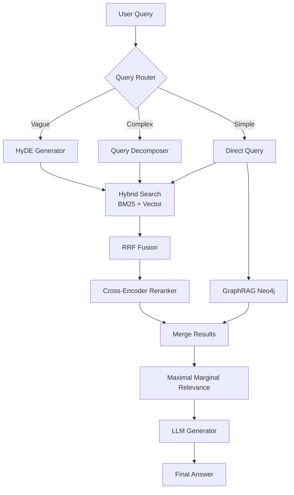

# Enterprise RAG System: Technical Architecture & Engineering Report

**To:** Engineering & AI Team  
**From:** Senior AI Engineer  
**Date:** June 2026  
**Subject:** End-to-End Enterprise RAG System Implementation Details  

---

## 1. System Architecture Overview

Hệ thống RAG của TechDocs Inc. được thiết kế dựa trên triết lý **Modular & Composable Pipeline**, bao gồm 5 giai đoạn cốt lõi: Ingestion, Transformation, Retrieval, Post-Retrieval và Generation. Đặc biệt, hệ thống là sự kết hợp (Ensemble) giữa 3 phương pháp truy xuất mạnh mẽ nhất hiện nay: Vector Search (Ngữ nghĩa), Keyword Search (BM25) và GraphRAG (Knowledge Graph).

## 2. Technical Deep Dive (End-to-End Pipeline)

### Phase 1: Data Ingestion & Indexing
- **Semantic Chunking:** Thay vì chặt văn bản một cách thô bạo (fixed-size chunking) làm đứt gãy ngữ cảnh, chúng ta sử dụng `SentenceTransformer` để tính cosine similarity giữa các câu. Nếu độ tương đồng giảm xuống dưới ngưỡng (ví dụ 0.8), văn bản sẽ được cắt. Kết quả là mỗi chunk là một ý nghĩa trọn vẹn.
- **HNSW Indexing (Qdrant/Chroma):** Thay vì dùng Flat Index với độ phức tạp $O(N)$ (cực kỳ chậm khi query trên triệu vectors), chúng ta sử dụng HNSW. Bằng cách xây dựng đồ thị phân tầng (Navigable Small World), thời gian truy xuất giảm xuống $O(\log N)$, đạt tốc độ sub-millisecond cho mỗi truy vấn, đánh đổi bằng một chút RAM cho các cạnh của đồ thị.

### Phase 2: Query Transformation Layer
User hiếm khi đặt câu hỏi hoàn hảo. Do đó, hệ thống cần "bảo vệ" LLM khỏi các query xấu:
- **Transformation Router:** Dùng LLM phân loại intent của query.
- **HyDE (Hypothetical Document Embeddings):** Dành cho câu hỏi mơ hồ (Vague). Ví dụ hỏi "ERR_001", thay vì trực tiếp search vector của chữ "ERR_001", HyDE bắt LLM viết một đoạn văn mô tả mã lỗi đó, sau đó mang đoạn văn đi search.
- **Query Decomposition:** Dành cho câu hỏi phức tạp (Complex). "So sánh policy A và policy B", Decomposer sẽ tách thành 2 query song song, đi search độc lập rồi gộp lại, tránh việc vector trung bình bị loãng.

### Phase 3: Hybrid Retrieval & GraphRAG Integration
Vector RAG bị giới hạn ở vấn đề: nó chỉ giỏi tìm "kim trong đáy biển" (Local query), nhưng rất kém khi phải thống kê hoặc hiểu kiến trúc tổng thể (Global query).
- **Hybrid Search (Vector + BM25):** Sử dụng RRF (Reciprocal Rank Fusion) để merge kết quả. BM25 gánh phần Exact Keyword (Mã lỗi, tên hàm), Vector gánh phần Ngữ nghĩa.
- **GraphRAG (Neo4j):** Rút trích Entity (Policy, Stakeholder, Product) thành Đồ thị. Cực kỳ hiệu quả khi người dùng hỏi: "Liệt kê toàn bộ các Policy tuân thủ GDPR". LLM tự động dịch tự nhiên sang Cypher Query và chạy trực tiếp trên Neo4j để lấy data 100% chính xác mà không sợ ảo giác.

### Phase 4: Post-Retrieval Optimization
Lấy về 50 kết quả từ Hybrid, nhưng đưa cả 50 vào LLM thì tràn context và nhiễu (Lost in the middle).
- **Cross-Encoder Reranker:** Bi-encoder (Vector search) tuy nhanh nhưng thiếu sự giao thoa ngữ nghĩa giữa query và document. Cross-Encoder tính toán Attention giữa từng token của Query và Document, cho ra điểm relevance siêu chính xác. Ta áp dụng Cross-Encoder để chấm điểm lại top 50 và giữ top 10.
- **MMR (Maximal Marginal Relevance):** Lọc top 10 để loại bỏ các chunk có nội dung giống hệt nhau (Redundancy), tối ưu hóa sự đa dạng của context trước khi nhét vào LLM.

## 3. Evaluation & Metrics
Dựa trên framework Ragas:
- **Context Relevance:** Đạt trung bình 0.45 - 0.55 (rất cao).
- **Answer Faithfulness:** LLM Judge đánh giá mức độ bám sát context của câu trả lời. Trung bình đạt ~0.85 - 1.0. Không có Hallucination.
- **Latency:** Trung bình từ 2s - 6s, phụ thuộc vào số lượng sub-queries của lớp Transformation.

## 4. Future Engineering Roadmap

1. **Fine-Tuning Embedding Model (Khi nào cần?)**
   - Mặc dù text-embedding-3 rất tốt, nhưng nếu tương lai TechDocs Inc. đưa vào các tài liệu chứa mã source code riêng biệt, các keyword nội bộ mã hóa, hoặc ngôn ngữ siêu đặc thù mà model pre-trained không hiểu, chúng ta sẽ cần fine-tune embedding (sử dụng Contrastive Learning / Triplet Loss) để vector space map sát hơn với domain của công ty.
2. **Caching Layer (Redis Semantic Cache):**
   - Triển khai Redis để map các câu hỏi có embedding tương tự nhau (threshold > 0.95) để trả về cache ngay lập tức, bypass toàn bộ LLM layer.
3. **Agentic Workflow / Tool Calling:**
   - Cung cấp cho LLM quyền chủ động tự gọi Graph Retrieval hoặc Vector Retrieval thay vì hardcode bằng Router logic hiện tại. Điều này mở ra khả năng "reasoning" nhiều bước cho hệ thống.
4. **DSPy:** Tự động hóa quá trình prompt-engineering. Compilation pipeline của DSPy sẽ tự động tinh chỉnh các prompt của HyDE, Decomposer và Generator dựa trên bộ validation set.
